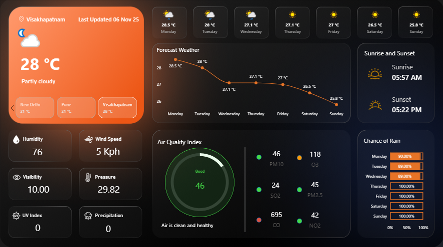

# Weather_dashboard

# 🌦️ Power BI Weather Dashboard

This Power BI dashboard visualizes real-time **weather conditions, air quality, and forecasts** for major Indian cities.  
It is designed to provide an interactive and visually appealing summary of temperature, humidity, visibility, and pollution metrics.

---

## 📊 Dashboard Overview

---

## 🌐 Live Dashboard Link
🔗 [View the Live Dashboard on Power BI](https://app.powerbi.com/view?r=eyJrIjoiNzZiOGZhZmMtMTAwNC00ZTg1LTkzZWYtMGU1Yzk0N2UwYjRiIiwidCI6IjFjMWM1MzJjLWRhMDQtNDEwMy05YmZhLWQzNmRmZGIxYjE3ZSJ9)  
*(This link opens the live published version of the dashboard.)*

---

## 🧠 Key Insights
- Real-time weather and temperature trends  
- Air Quality Index (AQI) classification and warning indicators  
- Sunrise/Sunset and humidity data  
- Weekly forecast visualization  

---

## 🛠️ Tools & Technologies
- **Power BI** for data visualization  
- **Weather API / CSV Dataset** for weather data  
- **DAX & Power Query** for data transformation  
- **Microsoft Power BI Service** for dashboard hosting  

---
